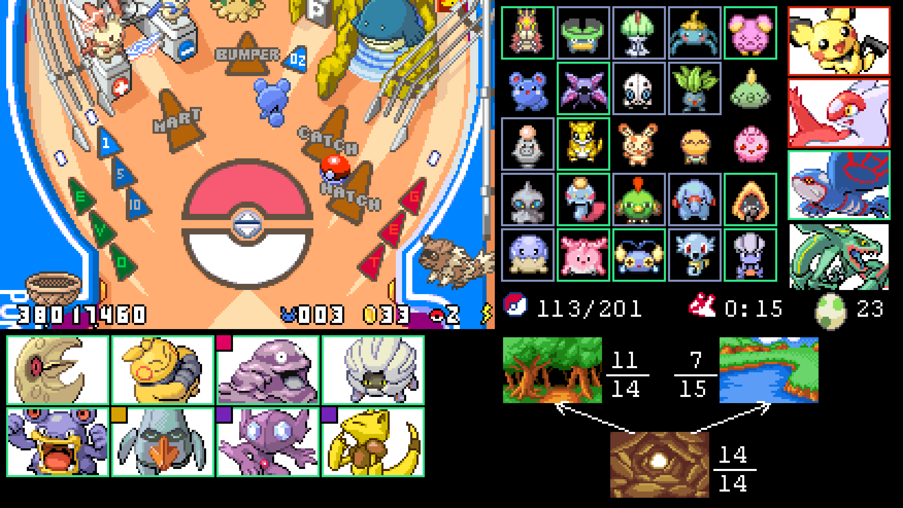

# _Pokémon Pinball: Ruby & Sapphire_ Pokédex Tracker

A [BizHawk](https://github.com/TASEmulators/BizHawk) lua overlay for _Pokémon Pinball: Ruby & Sapphire_ to assist with Pokédex completion and related tracking.

## Features

- Displays which Pokémon are catchable in the current area
- Displays which Pokémon are hatchable in the current field
- Displays Pokédex status of relevant Pokémon, including if evolution is necessary
- Displays if a Pokémon is rare or requires 2 or 3 GET arrows
- Displays current and potential next areas with completion counters to inform travel decisions
- Displays progress during Bonus Stages
- 16:9 aspect ratio (including game display) for convenient recording or fullscreen.

## Installation

- Download all .lua script files from the `overlay/` folder to the same location on your computer
- Load your _Pokémon Pinball: Ruby & Sapphire_ (USA) ROM in BizHawk's mGBA core. This overlay is not compatible with other game versions.
- Go to Tools -> Lua Console, then inside the console, Script -> Open Script
- Select Overlay.lua (the other scripts will be loaded automatically)
- The script should automatically start running. The first time you load the script, the game will pause for a bit to extract images, but this won't be repeated for future play sessions.

## Legend

A Pokémon's Pokédex status is denoted by coloured borders

- Black/no border: Uncaught
- Orange: Caught, but not fully evolved
- Magenta: Caught this session, but not fully evolved
- Green: Fully evolved
- Purple: This special Pokémon (Pichu/Latios/Latias) is eligible to spawn

Information about a Pokémon's spawning is denoted by a coloured square in the top left of their icon

- Gold: Rare (lower base appearance weight)
- Blue: Only appears if 2 GET arrows are lit
- Red: Only appears if 3 GET arrows are lit

A green square next to the Pokédex total indicates that the Rayquaza bonus game has been cleared this play session (note: not only this board), which raises the chance of Latios and Latias spawning from 1% to 2%, and due to a bug reduces the chance of Pichu spawning from 2% to 1%.

## Other Files

The 4 lua scripts are all you need to run the overlay - the two other folders in this repository are for development and reference.

- `scripts/` includes one-time scripts I used while developing the overlay and are archived in case the code is useful again in the future
- `docs/` includes documentation on game data and graphics formats used or derived while developing the overlay

## Acknowledgements

- [`The Pokémon Pinball: Ruby & Sapphire Decompilation Project`](https://github.com/pret/pokepinballrs) was an invaluable resource for understanding memory layout and file formats, as well as uncovering game mechanic knowledge that underpins some of the layout's design decisions.
- [`UnopenedClosure's Professor Oak Challenge TAS Overlay`](https://github.com/UnopenedClosure/ProfOakTASOverlay) was used as reference for how to build a visual overlay with BizHawk's lua scripting. The memory reading approach was taken directly under the GPLv3 license.
